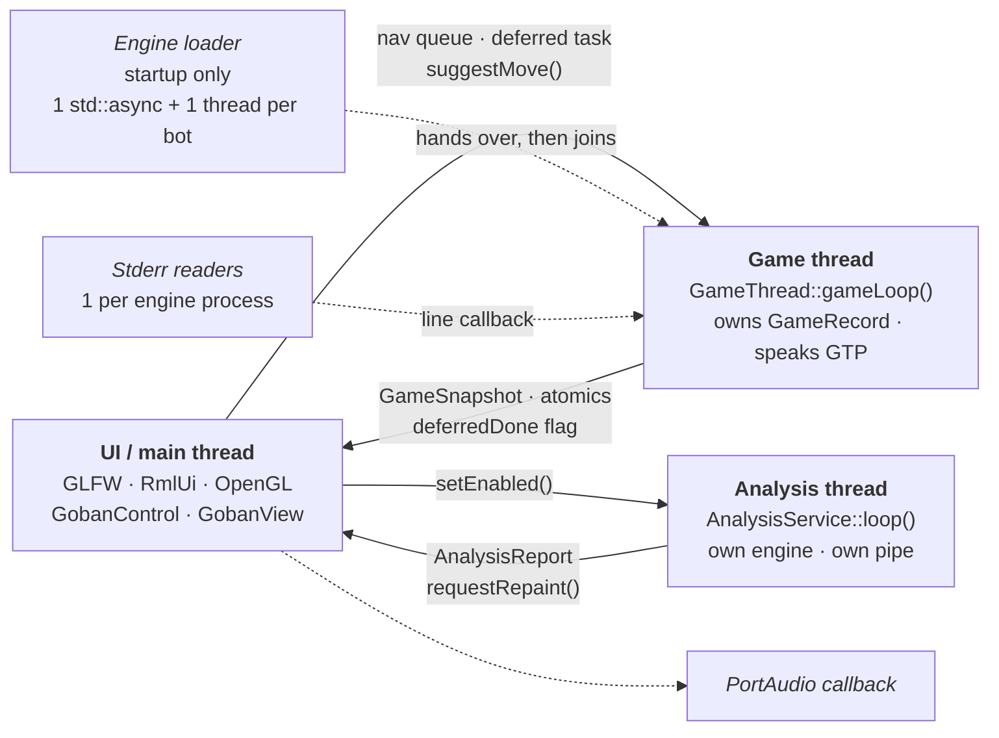
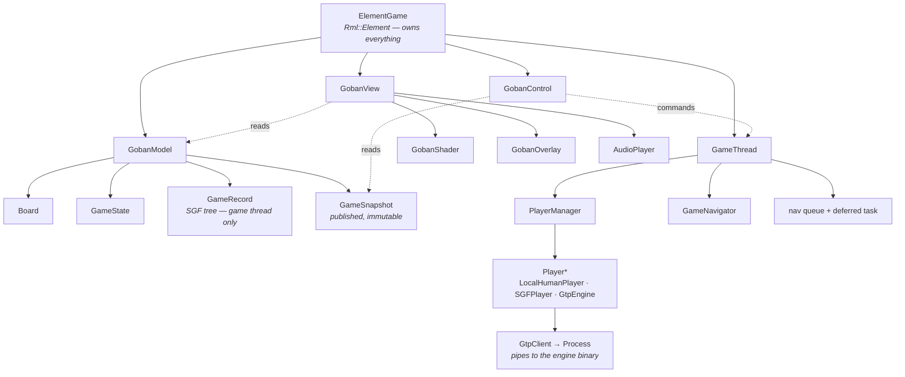
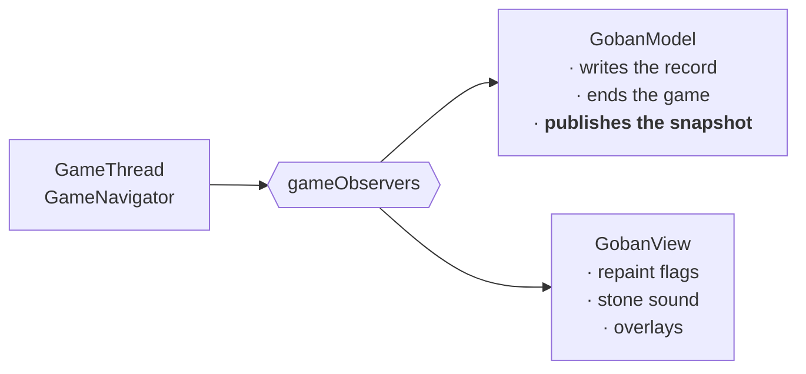
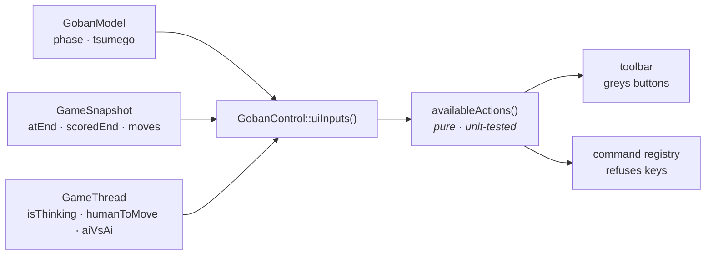
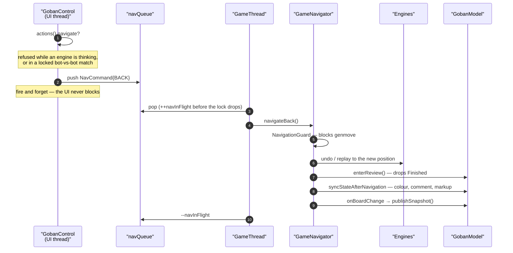
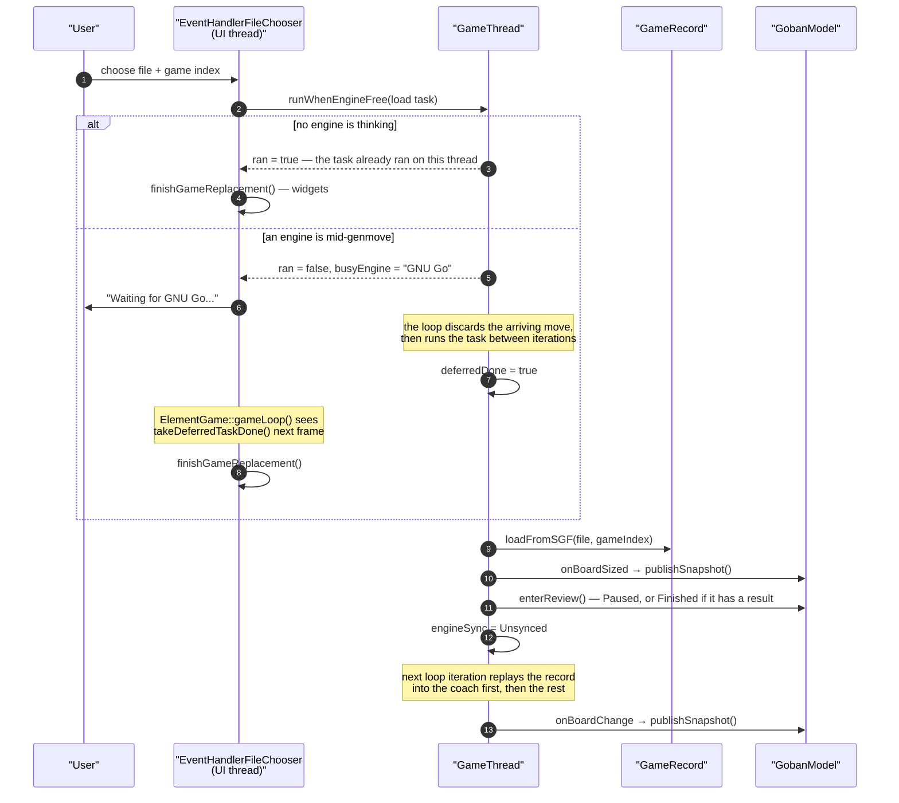
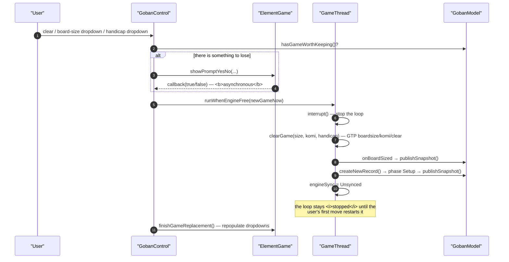
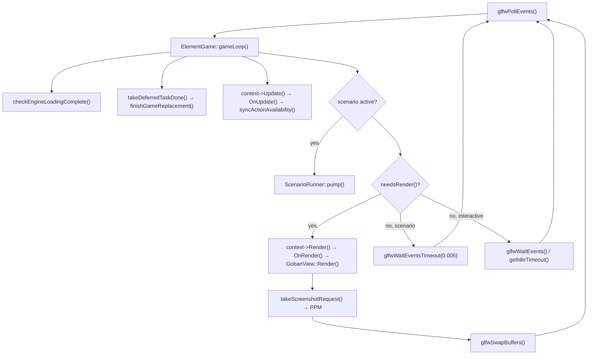

# Architecture

A map of the code: which object owns what, which thread may touch it, and how a
user action becomes a stone on the board.

This document is the *shape* of the program. It deliberately does not repeat the
rules — those live in two places that are meant to be read alongside it:

- **[CLAUDE.md](../CLAUDE.md) § Design Invariants** — rules that must always
  hold, most of them with a test behind them.
- **[docs/adr/](adr/README.md)** — why the shape is what it is, including the
  alternatives that were rejected.

Where a claim here matters enough to be enforced, it links to one of those.

---

## 1. Two layers

| Target | What it is | Contains |
|---|---|---|
| **`goban_core`** (static lib) | Rules, records, engine communication, policy. **No OpenGL, no RmlUi rendering.** | `GameThread`, `GameRecord`, `GobanModel`, `GameNavigator`, `PlayerManager`, `player`, `gtpclient`, `Board`, `UiActions`, `Configuration`, `UserSettings`, `Metrics`, `ScenarioRecorder` |
| **`goban`** (executable) | Rendering, UI, audio, platform glue | `main`, `ElementGame`, `GobanControl`, `GobanView`, `GobanShader`, `GobanOverlay`, `Event*`, `sound/`, `glad`, `ScenarioRunner` |

The split exists so `goban_tests` can link the core without a graphics context.
That constraint is load-bearing: it is why `availableActions()` is a pure
function over a plain struct rather than a method on `GobanModel`, and why
`UiActions.h` lives in the core while the toolbar that consumes it does not.

There is no `shell/` layer any more — window creation, input and fullscreen are
GLFW plus the small [`AppState`](../src/AppState.h) namespace.

---

## 2. Threads

Six kinds of thread exist. Only the first two matter for most work.



The analysis thread is the newest and the most isolated: it shares no pipe and no
engine object with the game thread, reads the position through the same published
snapshot the UI does, and touches nothing the game loop owns. Its only question
for the game thread is `analysisMayRun()`, and the answer is only ever *no, wait*.
See [ADR-0007](adr/0007-analysis-engine-owns-its-own-pipe.md).

### Thread ownership

| Owned by | Data | Read from elsewhere how |
|---|---|---|
| **Game thread** | `GameRecord` (the SGF tree) | **Never directly.** Via `GobanModel::snapshot()` — [ADR-0006](adr/0006-publish-a-game-snapshot.md) |
| **Game thread** | Engine pipes, all GTP traffic during a game | Not at all; UI actions are refused or deferred — [ADR-0001](adr/0001-engine-exclusive-ui-actions.md) |
| **Analysis thread** | The analysis engine's pipe, and only that one | Not at all. It is a *different process* from the coach even when the same binary — [ADR-0007](adr/0007-analysis-engine-owns-its-own-pipe.md) |
| **UI thread** | RmlUi documents, all widgets | Not at all; the game thread signals via `takeDeferredTaskDone()` |
| **UI thread** | OpenGL context, `GobanView`, `GobanShader` | Not at all |
| **Either, one at a time** | `GobanModel::board`, `GobanModel::state` | `GobanModel::mutex` for the board update; `GameState` fields are mostly written by the game thread and read per-frame |
| **Shared, locked** | `PlayerManager` player list, coach/kibitz indices | `PlayerManager::mutex` — see below |
| **Lock-free** | `GamePhase`, `LoopState`, `EngineSync`, `Board::positionNumber`, `GameRecord::unsavedChanges`, `GobanView::updateFlag` | Atomics |

**`GameRecord` is the one to be careful about.** It is an SGF tree whose const
accessors take no lock, and whose own mutex covers neither the readers nor half
the mutators. Reading it from the UI thread is a real, observed crash — routing
`shouldShowTerritory()` through a per-frame path segfaulted in `SgfcProperty`'s
destructor about one run in six. The fix was not to lock it (`saveAs()` writes
the whole file under that mutex, so a per-frame reader would stall on disk I/O)
but to publish a snapshot. See §5.

**`PlayerManager` is the mixed one.** Writers run on the engine-loader threads at
startup; readers run on both the game thread and the UI thread for the whole
session. Everything goes through `PlayerManager::mutex`, with one deliberate
exception: `addEngine()`/`addPlayer()` do *not* lock, because their callers
already hold it while they also assign the coach/kibitz indices. That pairing
used to be the other way round — writers unlocked, readers locked — which is one
of the three partial-locking holes CLAUDE.md warns about.

**`GameThread::isOnGameThread()`** is a `thread_local` set at the top of
`gameLoop()`. It exists because `interrupt()` must be a no-op when called from
the loop it would join — and `run()` for the mirror reason: a deferred discarding
action runs `newGameNow()` / `finalizeGameLoad()` *on* the game thread, and both
end by asking for the loop. Starting a loop from inside it is at best a no-op;
the join it used to reach threw "Resource deadlock avoided" and aborted the
process.

---

## 3. The object graph

Everything hangs off one RmlUi element. `ElementGame` holds the four principals
**by value**, in this order:

```cpp
GobanModel model;      // state + the record
GobanView  view;       // rendering (GameObserver)
GameThread engine;     // the game loop  (holds GobanModel&)
GobanControl control;  // input + commands (holds all three)
```



Roles in one line each:

- **`GobanModel`** — the state everyone agrees on: board, `GameState`, the
  record, the lifecycle `GamePhase`, and the published snapshot. It is also a
  `GameObserver`, which is how the record gets written.
- **`GameThread`** — the game loop. Owns the only thread allowed to speak GTP
  while a game is running, and therefore the record. Delegates player lifecycle
  to `PlayerManager` and tree walking to `GameNavigator`.
- **`GobanControl`** — the UI thread's entry point. Mouse, keys, and the command
  registry (~70 named commands, which is also the scripting surface). Holds *no*
  policy of its own — see §6.
- **`GobanView`** — a `GameObserver` that turns board changes into repaints,
  overlays and sounds. Camera state (`cameraPan`, `cameraDistance`, `cam.rLast`)
  is authoritative here and mirrored into the shaders.
- **`ElementGame`** — the RmlUi glue: per-frame `OnUpdate()`, widget sync,
  prompts, and the async engine-loading state machine.

Two players deserve names: the **coach** is the engine that holds the
authoritative board (every move is played into it, and it does the scoring); the
**kibitz** engine is the one asked for suggestions and for analysis-mode replies.
Both are indices into `PlayerManager`, chosen by `"main"` and `"kibitz"` flags in
the bot configuration; by default the kibitz engine *is* the coach.

---

## 4. The observer fan-out

`GameThread` holds `std::vector<GameObserver*>`. Exactly two observers are ever
registered, both in `ElementGame`'s constructor:

```cpp
engine.addGameObserver(&model);
engine.addGameObserver(&view);
```



| Callback | Fired when | Notes |
|---|---|---|
| `onGameMove` | A move is *played* | Not during navigation. This is what appends to the record. |
| `onStonePlaced` | A stone appears | Both gameplay and navigation — it is the sound/overlay hook. |
| `onBoardChange` | **Any position change** | The funnel. See below. |
| `onBoardSized` | New game / board resize | Runs *before* the record is replaced. |
| `onKomiChange`, `onHandicapChange`, `onPlayerChange` | Setup edits | |

**`onBoardChange()` is the funnel every position change passes through** — moves,
all four navigations, SGF load, game switch, scoring, handicap. That is precisely
why it is the snapshot publish point, and why it is also where a finished game
gets finalized and autosaved.

Two paths bypass it and therefore publish for themselves:
`GobanModel::createNewRecord()` and `GobanModel::onBoardSized()`, because the
new-game path replaces the record after the resize notification rather than
through a board change.

> **If you change what the UI displays, publish it.** A missed publish shows up
> as stale UI; the scenario suite catches it, but only if the field is asserted
> on. Both misses in the original ADR-0006 change were caught on the first run.

---

## 5. The published snapshot

```mermaid
sequenceDiagram
    participant GT as "Game thread"
    participant M as "GobanModel"
    participant UI as "UI thread"

    GT->>M: onBoardChange(board)
    M->>M: board.updateStones() · positionNumber++
    M->>M: finalize + autosave if the game just ended
    M->>M: publishSnapshot() — walks the SGF tree once
    Note over M: swap shared_ptr under snapshotMutex

    UI->>M: snapshot()
    M-->>UI: shared_ptr<const GameSnapshot>
    Note over UI: immutable; safe to read many fields
```

`GameSnapshot` is plain data — move counts, `atEnd`, `hasResult`, `scoredEnd`,
the variation list, the comment, the markup. `GobanControl::uiInputs()`,
`boardClick()`, `dumpState()` and the annotation display all read it and nothing
else from the record.

Three things to know:

1. **It removes a cost as well as a race.** `moveCount()` walks to the root and
   `getLoadedMovesCount()` walks the whole main line; the UI was paying both
   every frame.
2. **An atomic guard is not exclusion.** `ElementGame` used to guard its comment
   read with the atomic `positionNumber`. That makes a write *visible* but grants
   no exclusion — copying a `std::string` or walking a `std::vector` across that
   edge is still a use-after-free. Publishing them makes the reader's copy
   immutable, which settles both halves.
3. **A scalar that changes off the position-change path becomes atomic instead.**
   `GameRecord::unsavedChanges` is the example: saving is not a position change,
   so it has no publish point.

What still reads the record directly, by design, is listed in
[ADR-0006](adr/0006-publish-a-game-snapshot.md): `hasGameWorthKeeping()`,
save/archive, and the file-chooser dialog seed — all on explicit user actions,
with the game loop stopped or not yet started.

---

## 6. One policy for what the user may do

`availableActions()` in [`src/UiActions.h`](../src/UiActions.h) is a pure
function from a plain `UiInputs` struct to nine booleans. `GobanControl::uiInputs()`
is the single gatherer. Both the toolbar (`ElementGame::syncActionAvailability()`)
and *every* command guard read the same answer.



This was a *rule* three times — "make the button ask the same question the
command asks" — and it decayed three times, each time producing a disabled button
that looked like a guard and was not one.
[ADR-0005](adr/0005-one-policy-for-player-actions.md) finished the job. To add an
action: extend `UiInputs`/`UiActions`, add the rule to `availableActions()`, add a
case to `tests/test_uiactions.cpp`. Do not hand-roll a second condition at either
call site.

One trap worth repeating here, because it is not obvious from the type:
**`isThinking()` is not "the engine is busy".** The game loop clears
`playerToMove` *before* its 500 ms inter-move sleep, so `isThinking()` is false
for that window on every move. Guards written as a bare `isThinking()` test have
a hole once per move. Ask `actions()`, which carries `aiVsAiLocked` too.

---

## 7. Four flows, end to end

### 7.1 A move

Human plays against an engine, in match mode, at the end of the line.

```mermaid
sequenceDiagram
    autonumber
    participant U as "User"
    participant RML as "RmlUi"
    participant C as "GobanControl<br/>(UI thread)"
    participant GT as "GameThread<br/>(game thread)"
    participant E as "Coach engine"
    participant M as "GobanModel"
    participant V as "GobanView"

    U->>RML: click on the board
    RML->>C: EventHandlerNewGame → mouseClick → boardClick
    C->>M: snapshot() — variations, colorToMove, atEnd
    Note over C: first click only picks the stone up<br/>(holdsStone); it is not yet a move
    U->>C: second click
    C->>M: start() — phase → Playing
    C->>GT: run() if the loop is stopped
    C->>GT: playLocalMove(move)
    GT->>GT: playerToMove->suggestMove(move)

    Note over GT: the loop was blocked in<br/>LocalHumanPlayer::genmove()
    GT->>E: play(move) — GTP
    E-->>GT: =
    GT->>GT: syncOtherEngines(move)
    GT->>M: onGameMove → GameRecord::move()
    GT->>V: onStonePlaced → sound
    GT->>GT: buildBoardFromMoves() — local capture logic
    GT->>M: onBoardChange → publishSnapshot()
    GT->>V: onBoardChange → repaint flags
    Note over GT: 500 ms pause, then genmove for the engine's colour
```

Two details that surprise people:

- The board is rebuilt **from the SGF record**, not from the engine's answer.
  `GameRecord::buildBoardFromMoves()` replays the whole path from the root with
  local capture and ko logic. `replayMoves()` stops at the first move it rejects,
  so its return value must always be checked against the path length — an ignored
  short count is a silently truncated position.
- `suggestMove(Move::INVALID)` is ignored rather than stored, because the loop
  issues one on every iteration and it used to overwrite a real click that landed
  microseconds earlier.

### 7.2 A navigation

Left arrow, or the Undo button, or a click on an existing variation.



Navigation is asynchronous, which is why quiescence needs `hasPendingNavigation()`
and not just `isThinking()`. `navInFlight` is incremented while the queue mutex is
still held: without it a command is invisible between the pop and the navigator
raising its own flag, and a caller polling for idle reads the board before
navigation has applied it.

`GobanControl::isIdle()` must account for **all four** of engine thinking, queued
*or in-flight* navigation, a deferred action still running, and
`EngineSync::Syncing`. Every gap there has produced a flaky scenario at least
once. It deliberately does *not* cover territory scoring — see the invariant in
CLAUDE.md.

### 7.3 An SGF load



Loading is a *discarding* action in [ADR-0001](adr/0001-engine-exclusive-ui-actions.md)'s
sense: the pending genmove is worthless, so it is deferred past the engine rather
than refused. The split matters — the engine/model half may run on the game
thread, but **every widget update must go in `GobanControl::finishGameReplacement()`**,
which the UI thread calls. RmlUi is not thread safe.

A loaded game stays **paused**. Human moves work through the navigation path
(`navigateToVariation`); engine play requires an explicit Start.

### 7.4 A new game



Three things here catch people out:

- **All three replacement paths confirm first**, and the answer is
  **asynchronous**: the callback arrives after the handler returns, so a widget
  cannot revert its own selection at the call site. Take an `onSettled(bool)`
  callback, as `EventHandlerNewGame` does.
- **A confirmation and the action behind it must not disagree.** Once
  `hasGameWorthKeeping()` has decided the question is worth asking, the action
  must honour a yes. `setHandicap()` once kept a second `phase() != Playing`
  guard that refused in exactly the case the prompt was shown for, so confirming
  did nothing at all. The `request*` half holds the policy; the half that does
  the work holds none.
- **`new_game <size>` deliberately does not prompt.** It is the scripting entry
  point; a modal would deadlock a scenario. `board_size` and `handicap` take the
  dropdowns' route instead, prompt included.

After a new game the engines are `Unsynced` while the loop is *stopped*.
`Unsynced` is therefore **not** "busy" — only `Syncing` is. Waiting on `Unsynced`
would never return.

---

## 8. Startup

Startup is unusual enough to be worth its own picture: the window is up and
interactive before any engine has spoken.

```mermaid
sequenceDiagram
    autonumber
    participant MAIN as "main()"
    participant EG as "ElementGame<br/>(UI thread)"
    participant LD as "loader thread<br/>(std::async)"
    participant B as "one thread per bot"
    participant GT as "Game thread"

    MAIN->>MAIN: GLFW window · glad · RmlUi · Configuration
    MAIN->>EG: EventManager::LoadWindow → "load" event
    EG->>EG: populateUIElements() · animateIntro()
    Note over EG: board renders immediately —<br/>board size peeked from the SGF header
    EG->>LD: startAsyncEngineLoading()
    LD->>B: spawn one thread per enabled bot
    B-->>LD: first engine ready
    LD->>LD: loadSGFWithEngine — <b>stones appear</b>
    LD->>LD: wait for the coach specifically
    LD->>GT: engineSync = Unsynced; run()
    Note over GT: drains any queued session tree-path<br/>navigation, scores if finished
    B-->>LD: remaining engines ready → join all
    LD->>LD: loadHumanPlayers · finalizeGameLoad
    EG->>EG: checkEngineLoadingComplete() (per frame)
    EG->>EG: performDeferredInitialization()
    EG->>EG: control.finishInitialization() → uiReady
```

Until `uiReady`, `availableActions()` returns all-false and every command is
refused — which is also why a scenario must wait for `areEnginesLoaded()`.

Session state (last SGF, game index, tree path, tsumego/analysis mode, camera) is
persisted in `user.json` by `UserSettings` and restored here. The tree-path
navigation is *queued before the engines start*, so it runs on the game thread
like any other navigation — one path, no special case.

---

## 9. The main loop



Rendering is **event driven**: with nothing to draw the loop blocks in
`glfwWaitEvents()`. Anything that changes the picture must therefore raise
`GobanView::updateFlag` (via `requestRepaint()`), and anything that completes
*without* an input event must publish a timeout through
`ElementGame::getIdleTimeout()` — which is exactly why a pending deferred task
returns 50 ms there. A scenario generates no input events at all, hence the
separate polling branch.

---

## 10. Rendering

The board is ray-traced in GLSL fragment shaders; the vertex shaders set up the
camera and compute per-pixel ray origins and directions. `GobanView` holds the
authoritative camera (`cameraPan`, `cameraDistance`, `cam.rLast` quaternion) and
replicates the same camera model on the C++ side in `boardCoordinate()` for
screen→board ray casting.

The full coordinate system, the camera parameterisation, and the stereoscopic
deviation theory are documented in
[CLAUDE.md § Ray-Traced Rendering](../CLAUDE.md#ray-traced-rendering---coordinate-system-and-shaders);
they are not repeated here.

Text overlays go through `GobanOverlay` (glyphy + freetype). Sound goes through
`AudioPlayer` (PortAudio + libsndfile), driven from `onStonePlaced`.

Both overlay builders — `updateLastMoveOverlay()` and `updateNavigationOverlay()`
— run inside `Render()`, on the UI thread, once per repaint. They read
`GobanModel::snapshot()` and nothing else; they were the last readers walking the
SGF tree from that thread (ADR-0006 stage 4).

---

## 10a. Saying something to the user

Three surfaces, deliberately disjoint:

| Surface | Carries | Fed by |
|---|---|---|
| `#lblStatus` + `#pnlLog` (top left) | Which engine is loading; a badge for warnings and errors | `MessageLog`, via a **spdlog sink** |
| `#lblMessage` (bottom centre) | Game results, SGF comments, command feedback, confirmation prompts | `ElementGame::showMessage()` |
| `#grpAnalysis` (bottom right) **or** the board's near margin | The live evaluation (issue #49): win rate and score estimate. One surface with two forms, never both at once — the diegetic one is a View → Overlay toggle. Silent in tsumego mode, where the best move is the solution | `AnalysisService::report()`, read per frame |

The first two split on *ownership* — application status versus game content. The
third splits on a different axis, which is why it could not join either:
`#lblMessage` carries **events**, things that happened once and scroll past;
`#grpAnalysis` carries **state**, a value that is continuously true and repaints
twice a second. See [ADR-0007](adr/0007-analysis-engine-owns-its-own-pipe.md)
decision 11.

The sink is the important part: `installMessageLogSink()` means every
`spdlog::warn`/`error` already in the codebase reaches the interface without its
call site being touched. Before it, engine failures, GTP timeouts and failed
saves went to `last_run.log` and nowhere else, so "my engine does not work" and
"the application does nothing" looked identical from outside.

It takes `warn` and above. `GtpClient` logs every command and response at `info`,
so admitting `info` would let one genmove evict the failure the panel exists to
show — and demoting that traffic is not an option, because `last_run.log` is what
users attach to bug reports. See CLAUDE.md § Telling the User Something.

---

## 11. Scripting and tests

The command registry in `GobanControl` is a single surface used by three callers:
RmlUi widgets, keybindings (`Configuration::getCommand`), and `ScenarioRunner`.
That is deliberate — a scenario drives the *same* code path a user does.

- **`goban_tests`** links `goban_core` and needs no graphics context.
- **`mock_gtp_engine`** stands in for a real engine, deterministically.
- **`tests/scenarios/*.scn`** drive the built application: `command`,
  `wait_until`, `expect <key> <value>`. The keys come from
  `GobanControl::dumpState()`, which prints in full on failure so a failed
  expectation is diagnosable without a debugger.
- **`ScenarioRecorder`** captures a live session into a replayable script.

See [docs/testing.md](testing.md).

---

## 12. Where to look

| Question | File |
|---|---|
| What may the user do right now? | `src/UiActions.h` / `.cpp` |
| What is the game doing? | `src/GamePhase.h`, `GobanModel::phase()` |
| Is the loop running? Are engines synced? | `LoopState` / `EngineSync` in `src/GameThread.h` |
| What does the UI know about the record? | `src/GameSnapshot.h` |
| Where does the evaluation overlay come from? | `src/AnalysisService.h`, `ADR-0007` |
| How does a key become an action? | `GobanControl::buildRegistry()` |
| How is a position rebuilt? | `GameRecord::buildBoardFromMoves()` |
| How is an engine spoken to? | `src/gtpclient.h`, `GtpEngine` in `src/player.h` |
| Where is a game saved? | `GameRecord::saveAs()`, `docs/sgf-records.md` |
| Why is it like this? | `docs/adr/` |
| What must never break? | `CLAUDE.md` § Design Invariants |
